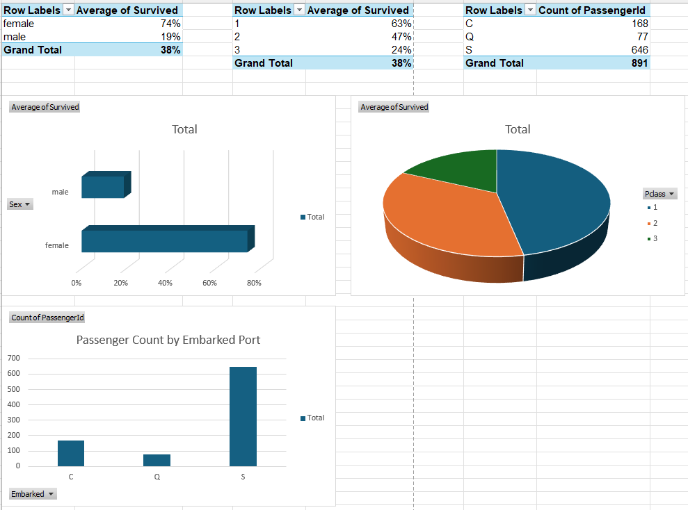

## 🚢 Titanic Dataset Analysis

### 🧩 Business Problem
The goal of this project is to analyze survival patterns from the Titanic dataset and build a reproducible data pipeline that prepares the data for visualization in **Excel and Power BI**. This project demonstrates ETL best practices, calculated field creation, and dashboard design for executive-level storytelling.

---

### 🛠️ Tools & Technologies
- **Python:** Pandas, NumPy, Matplotlib, Seaborn
- **Excel:** PivotTables, Slicers, KPI Calculations
- **Power BI:** DAX, Interactive Visuals, Slicers, Drilldowns
- **IDE:** Jupyter Notebook
- **Version Control:** Git/GitHub

---

### 📊 Project Objectives
- Clean and transform Titanic dataset for analysis
- Engineer useful features such as survival flag, child indicator, and family size
- Build reproducible workflows for dashboarding in Power BI and Excel
- Communicate business-relevant survival insights with visual clarity

---

### 🔁 ETL Process
1. **Extract:** Loaded Titanic dataset via Kaggle.
2. **Transform:**
   - Removed irrelevant columns (Name, Ticket, Cabin)
   - Created `IsChild`, `FamilySize`, `SurvivedText` columns
   - Filled missing values for `Embarked`
3. **Load:** Saved cleaned dataset as `Titanic_Cleaned_ForPowerBI.csv` and used it for dashboard builds.

---

### 📈 Key Insights
- **Females and 1st class passengers** had the highest survival rates.
- **Children under 10** had better odds than adults.
- **Fare paid and class level** correlated with survival chances.

---

### 🖼️ Visual Highlights

  
   <em>Survival Rate Comparison Between Genders</em>

  
   <em>Passenger Class vs Survival Rate</em>

  
   <em>Age Distribution by Survival</em>

  
   <em>Feature Correlation Heatmap</em>

  
   <em>Fare Trend by Survival</em>

---

### 📌 Results & Outcomes
- Cleaned and transformed dataset to support dashboard creation
- Created new features to enhance survival prediction analysis
- Built visuals across Power BI and Excel for executive-ready storytelling
- Delivered files ready for reuse, reporting, and portfolio display

---

### 🔗 Live Notebook
👉 [View the Titanic Jupyter Notebook on GitHub](https://github.com/YSayaovong/Titanic-Dataset-Analysis)

---

### 📅 Dashboards

#### 📊 Power BI Dashboard
- Download: [`Titanic_Survival_Dashboard.pbix`](https://github.com/YSayaovong/Titanic-Dataset-Analysis/blob/main/data/Titanic_Survival_Dashboard.pbix)
- Visuals: Clustered Column (Gender), Stacked Column (Class), Donut (Survival), Histogram (Age)
- Filters: Slicers for Gender, Class, Age, Embarked

#### 🖥️ Excel Dashboard
- Visuals: Survival by Gender, Class, and Embarked
- Includes: Column chart, pie chart, bar chart, slicer-friendly formatting
- Image Preview:

  

#### 🗌 PDF Export of Power BI Dashboard
- View: [`Titanic_Survival_Dashboard.png`](https://github.com/YSayaovong/Titanic-Dataset-Analysis/blob/main/data/Titanic_Survival_Dashboard.png)

---

Thank you for exploring this project! Feel free to fork it, ask questions, or adapt the pipeline for your own datasets. More updates coming soon!

