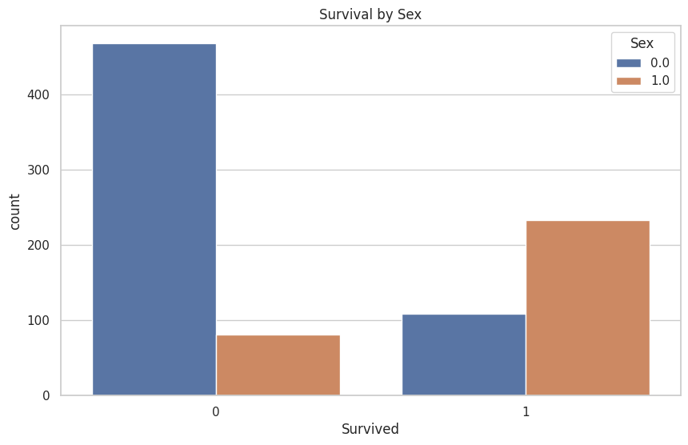
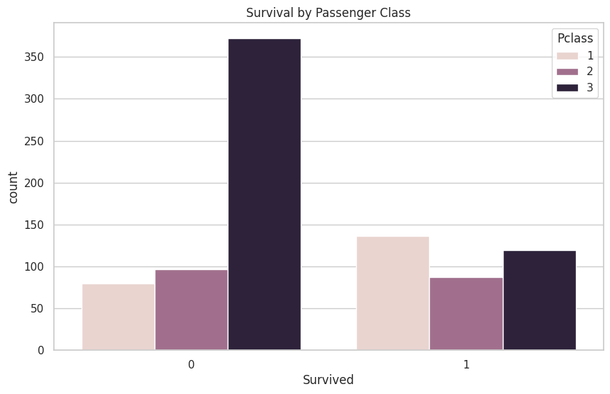
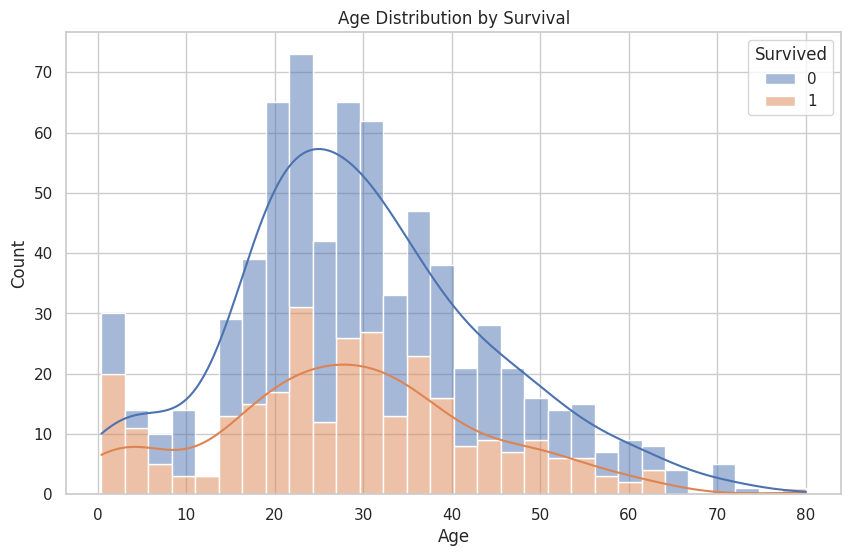
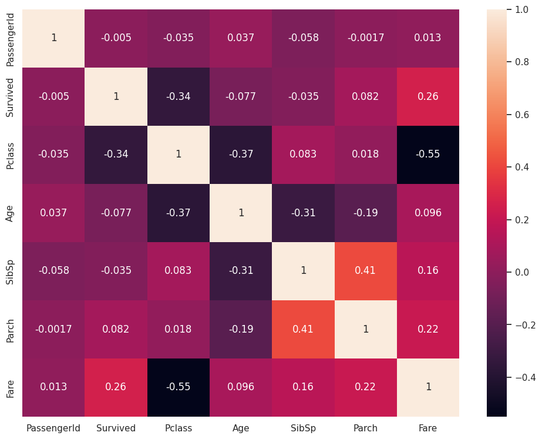
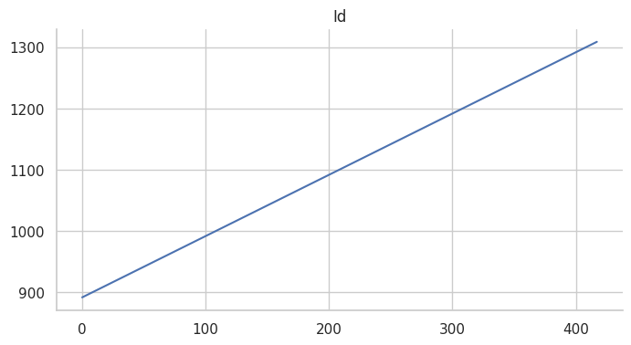

# Titanic Dataset Analysis

This project involves the analysis of the Titanic dataset to uncover key insights into the survival patterns based on various demographic and class attributes. The analysis leverages Python and its data visualization libraries to explore relationships and draw meaningful conclusions from the data.

## Analysis Overview

The Titanic dataset contains information about passengers on the Titanic, including details such as their survival status, class, age, sex, and more. The primary goal of this analysis was to identify factors that significantly impacted the likelihood of survival during the Titanic disaster.

## Steps Undertaken

1. **Data Cleaning and Preprocessing**: 
   - Handled missing data by filling or dropping incomplete rows.
   - Transformed categorical variables into numerical values where applicable.

2. **Exploratory Data Analysis (EDA)**:
   - Analyzed survival rates by gender, class, and age group.
   - Visualized the data using Python libraries such as `matplotlib` and `seaborn`.

3. **Data Visualization**:
   - Created visualizations to illustrate the relationships between survival and various attributes. The visualizations include:
     - **Survival by Gender**:
       
     - **Survival by Passenger Class**:
       
     - **Age Distribution by Survival Status**:
       
     - **Correlation Heatmap of Features**:
       
     - **Time or Count Trend Analysis**:

       

4. **Key Insights**:
   - Survival rates were significantly higher for women compared to men.
   - First-class passengers had a higher likelihood of survival compared to those in second or third class.
   - Younger passengers tended to have a better chance of survival, as evident from age distribution analysis.
   - Correlation analysis revealed a strong relationship between survival and passenger class as well as gender.

## Accomplishments

- Created visually appealing and informative plots that highlight key survival trends in the Titanic dataset.
- Identified critical factors such as gender and class that influenced survival rates.
- Developed a deeper understanding of the dataset through statistical and visual analysis.

## Files Included

- **Analysis Notebook**: `AnalysisOfTheTitanicDataset.ipynb` - Contains the full code for data cleaning, EDA, and visualization.
- **Visualizations**:
  - `survival_by_sex.png` - Survival rates based on gender.
  - `survival_by_pclass.png` - Survival rates based on passenger class.
  - `age_distributin_by_survival.png` - Age distribution segmented by survival status.
  - `heatmap.png` - Correlation heatmap of the dataset's features.
  - `line_graph.png` - Line graph showcasing trends in the dataset.

## Tools Used

- **Programming Language**: Python
- **Libraries**: Pandas, NumPy, Matplotlib, Seaborn

